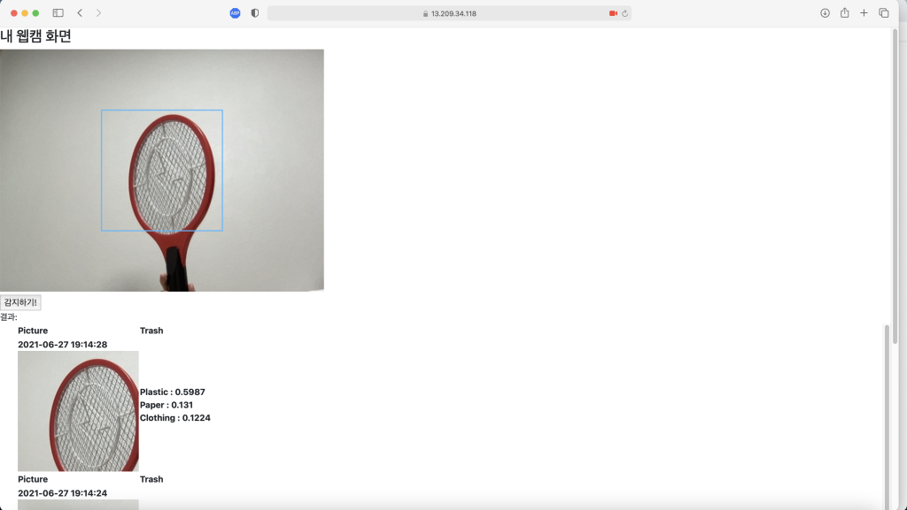

### requirements
~~~
asgiref           3.3.4    
Django            3.2.4    
django-sslserver  0.22     
numpy             1.21.0   
opencv-python     4.5.2.54 
Pillow            8.2.0    
sqlparse          0.4.1    
torch             1.8.1+cpu
torchaudio        0.8.1    
torchvision       0.9.1+cpu
~~~

### 설명
https://github.com/bcaitech1/p4-mod-model_diet 에서 진행한 모델을 Django로 실행하고 싶어서 만듬.

### 실행
웹캠을 실행하기 위해선 https로 열어야 하며, https로 실행하기 위한 ssh key를 받고 실행한다.

